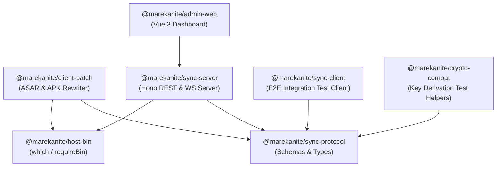

# Marekanite

<p align="center">
  
</p>

<p align="center">
  <strong>Independent, self-hosted sync backend and build rewriter for desktop & mobile note-taking clients.</strong>
</p>

<p align="center">
  <a href="NOTICE"></a>
  <a href="package.json"></a>
  <a href="package.json"></a>
  <a href="docs/protocol.md"></a>
</p>

> [!NOTE]
> **Legal & Trademark Disclaimer**: Marekanite is an independent open-source software project. **Obsidian®** is a registered trademark of Dynalist Inc. Marekanite is not affiliated with, endorsed by, or sponsored by Dynalist Inc. Using this software requires you to bring your own legally acquired copy of the official client app. This repository does not distribute proprietary binaries, `.asar` packages, or APK files.

---

## 🌟 Features & Highlights

- **Complete Protocol Server**: REST + WebSocket synchronization engine built with [Hono](https://hono.dev/) and [SQLite](https://sqlite.org/).
- **Zero-Knowledge Ciphertext**: All vault content and encryption keys remain strictly client-side; server stores encrypted blobs only.
- **Integrated Admin Panel**: Modern Vue 3 dashboard to create vault accounts, manage users, monitor patch jobs, and deploy updates.
- **Desktop & Mobile Patching**: Rewriter tool to patch legally acquired desktop `.asar` and Android `.apk` client binaries for self-hosted server endpoints.
- **Wireless & USB Mobile Deployment**: Direct Android installation support via WebUSB or server-managed Wi-Fi `adb`.

---

## 🚀 Quick Start

### Using Docker Compose (Recommended)

```bash
# 1. Clone environment template
cp .env.example .env

# 2. Launch server container
docker compose up -d --build
```

Access the admin dashboard at `http://127.0.0.1:8787`. Create your first vault account and patch your client package.

---

## 📚 Documentation Index

| Topic Guide | Description |
| :--- | :--- |
| 📦 [Installation Guide](docs/install.md) | Docker Compose setup, volume management, and environment variables |
| 💻 [Local Development](docs/local-dev.md) | Workspaces, build commands, test runner, and local Vite dev server |
| 🌐 [Production Deployment](docs/deploy.md) | Reverse proxy configuration (Caddy, Traefik), SSL/TLS, and domain setups |
| 🔧 [Patching Guide](docs/patch-client.md) | Step-by-step instructions for patching desktop `.asar` and Android `.apk` |
| 🔐 [Security Overview](docs/security.md) | Encryption model, threat vectors, LAN isolation, and authentication gates |
| ⚖️ [Solution Comparison](docs/compare.md) | Compare Marekanite against official cloud sync, LiveSync, and Syncthing |
| 🧪 [Compatibility Matrix](docs/compatibility.md) | Rewriter needle analysis and tested client versions (1.13.7 down to 1.5.8) |
| 📑 [Protocol Specification](docs/protocol.md) | Reimplemented REST endpoints, WebSocket message frames, and binary streaming |

---

## 🛠️ Host System Dependencies

Docker Compose bundles all necessary tools inside the container. For local `pnpm` workspace development (without Docker), install the following dependencies on your host system:

| Dependency | Purpose |
| :--- | :--- |
| **Node.js 24+** & **pnpm 11.17** | Required to run and build the TypeScript workspace (managed via Corepack) |
| **`zip`**, **`unzip`**, **`curl`**, **`wget`**, **`ca-certificates`** | APK archive unpacking, release downloads, and health checks |
| **`7z`** (`p7zip-full` / `p7zip`) | Extracting `.asar` bundles from macOS `.dmg` or Windows `.exe` installers |
| **OpenJDK 17+ JRE**, **`apksigner`**, **`zipalign`** | Aligning and signing patched Android APK binaries |
| **`adb`** | Wireless Android installation via the admin UI |

### Operating System Setup Commands

<details>
<summary><strong>Debian / Ubuntu Installation Instructions</strong></summary>

```bash
# Install Node.js 24 via fnm/nvm or NodeSource, then run:
sudo apt-get update
sudo apt-get install -y ca-certificates curl wget unzip zip p7zip-full \
  openjdk-17-jre-headless adb apksigner zipalign

# Enable pnpm via Corepack
sudo corepack enable
sudo corepack prepare pnpm@11.17.0 --activate

# Verify versions
node -v    # v24.x or newer
pnpm -v    # 11.17.x
```
</details>

<details>
<summary><strong>Arch Linux Installation Instructions</strong></summary>

```bash
sudo pacman -S --needed nodejs npm pnpm zip unzip wget curl ca-certificates \
  p7zip jre17-openjdk-headless android-tools

# Optional Android build-tools setup for APK signing:
ANDROID_HOME="${ANDROID_HOME:-$HOME/Android/Sdk}"
mkdir -p "$ANDROID_HOME/build-tools"
wget -q -O /tmp/build-tools.zip https://dl.google.com/android/repository/build-tools_r34-linux.zip
unzip -q /tmp/build-tools.zip -d "$ANDROID_HOME/build-tools"
rm /tmp/build-tools.zip
mv "$ANDROID_HOME/build-tools/android-14" "$ANDROID_HOME/build-tools/34.0.0"
export PATH="$PATH:$ANDROID_HOME/build-tools/34.0.0"
```
</details>

---

## 📦 Repository Topology & Packages



| Package | Workspace Directory | Role & Function |
| :--- | :--- | :--- |
| [`@marekanite/sync-server`](packages/sync-server/README.md) | `packages/sync-server` | Hono REST API, WebSocket server, SQLite persistence, and admin server |
| [`@marekanite/admin-web`](packages/admin-web/README.md) | `packages/admin-web` | Vue 3 + Vite + Tailwind CSS admin control panel |
| [`@marekanite/sync-protocol`](packages/sync-protocol/README.md) | `packages/sync-protocol` | Shared TypeScript types, constants, and Zod validation schemas |
| [`@marekanite/client-patch`](packages/client-patch/README.md) | `packages/client-patch` | Desktop `.asar` and Android `.apk` binary rewriter engine & CLI |
| [`@marekanite/host-bin`](packages/host-bin/README.md) | `packages/host-bin` | Shared `which` / `requireBin` for host tools (`adb`, `7z`, `zip`, …) |
| [`@marekanite/sync-client`](packages/sync-client/README.md) | `packages/sync-client` | Automated protocol test client for end-to-end integration testing |
| [`@marekanite/crypto-compat`](packages/crypto-compat/README.md) | `packages/crypto-compat` | Test helpers for client key derivation and hash verification |

---

## 📜 License & Compliance

See [NOTICE](NOTICE) for complete licensing terms. Marekanite is source-available for personal and household self-hosting. Redistribution of patched official binaries is strictly prohibited.

