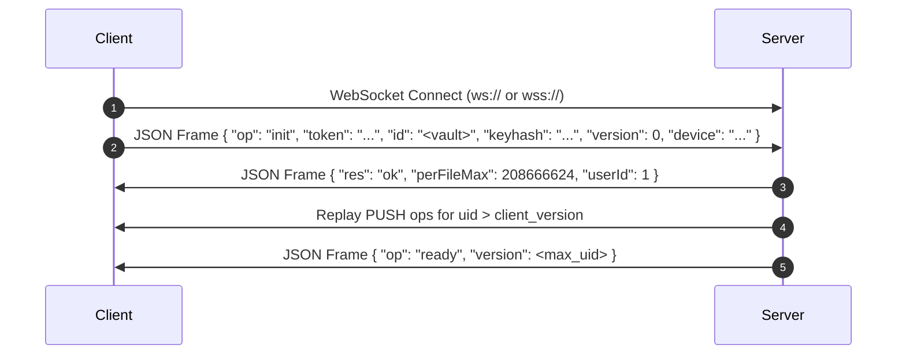

# Sync Protocol Specification

This document describes the reimplemented client-server synchronization protocol used by Marekanite. The specification
is reverse-engineered from the baseline client release (**1.13.4**).

---

## 🌐 Protocol Overview

- **REST API Transport**: HTTP `POST` requests with JSON payloads (`Content-Type: application/json`).
- **WebSocket Transport**: Full-duplex WebSocket connection on the same server host/port (`ws://` for HTTP, `wss://` for
  HTTPS).
- **Security Model**: Client-side Zero-Knowledge Encryption. File paths, folder structures, and file contents are
  encrypted client-side using scrypt/AES before transmission. The server stores ciphertext exclusively.

---

## 📑 REST API Specification

All REST requests are HTTP `POST` operations. Errors are returned as `{ "error": "<message>" }` in the response body.

### 🔑 Authentication Endpoints

| Endpoint Path              | Input Request Parameters                     | Successful Response Format                  |
|:---------------------------|:---------------------------------------------|:--------------------------------------------|
| `POST /user/signup`        | `email`, `password`, `name`, `next?`, `pow?` | `{ token, email, name, license }`           |
| `POST /user/signin`        | `email`, `password`, `mfa?`                  | `{ token, email, name, license }`           |
| `POST /user/signout`       | `token`                                      | `{}`                                        |
| `POST /user/info`          | `token`                                      | `{ email, name, license, ... }`             |
| `POST /user/authtoken`     | `token`                                      | `{ token }` (Refreshed auth session)        |
| `POST /user/pow-challenge` | Empty body                                   | Solvable local proof-of-work challenge stub |
| `POST /subscription/list`  | `token`                                      | Active sync entitlement stub response       |

### 📁 Vault Management Endpoints

| Endpoint Path         | Input Request Parameters                                 | Operational Notes                                      |
|:----------------------|:---------------------------------------------------------|:-------------------------------------------------------|
| `POST /vault/list`    | `token`, `supported_encryption_version`                  | Returns `{ limit, vaults: [...], shared: [...] }`      |
| `POST /vault/create`  | `token`, `name`, `keyhash`, `salt`, `encryption_version` | Registers a new vault record on the server             |
| `POST /vault/access`  | `token`, `vault_uid`, `keyhash`, `host?`                 | Verifies end-to-end keyhash string against database    |
| `POST /vault/rename`  | `token`, `vault_uid`, `name`                             | Renames target vault record                            |
| `POST /vault/delete`  | `token`, `vault_uid`                                     | Deletes vault and cascades removal of stored revisions |
| `POST /vault/regions` | `token`, `host?`                                         | Returns regional endpoint list                         |
| `POST /vault/share/*` | `token`, `vault_uid`, ...                                | Vault sharing invite / member management endpoints     |

---

## ⚡ WebSocket Synchronisation Protocol

The WebSocket server shares the HTTP listener port (`HTTP_PORT=8787`).

- **Text Frames**: Used for JSON operation messages (`init`, `push`, `pull`, `ready`).
- **Binary Frames**: Used for raw encrypted file payloads chunked at **2,097,152 bytes (2 MiB)** per piece (
  `PIECE_SIZE`).

### 🤝 Connection Handshake Sequence



#### 1. Client Init Payload (`op: "init"`)

```json
{
  "op": "init",
  "token": "usr_session_token_here",
  "id": "vault_identifier_hash",
  "keyhash": "derived_scrypt_key_hash",
  "version": 0,
  "initial": true,
  "device": "Laptop-Client-01",
  "encryption_version": 3
}
```

#### 2. Server Response (`res: "ok"`)

```json
{
  "res": "ok",
  "perFileMax": 208666624,
  "userId": 1
}
```

#### 3. Ready Notification (`op: "ready"`)

```json
{
  "op": "ready",
  "version": 1042
}
```

---

## 🔄 Operations Reference (`op`)

| Operation Code  | Role & Functionality                                                  |
|:----------------|:----------------------------------------------------------------------|
| `ping` / `pong` | Heartbeat keepalive ping                                              |
| `push`          | Client uploads file metadata (+ binary piece frames if file modified) |
| `pull`          | Client requests ciphertext revision download by revision UID          |
| `history`       | Fetches file modification history list for a path                     |
| `deleted`       | Queries deleted vault item list                                       |
| `restore`       | Restores a deleted or historical revision UID                         |
| `purge`         | Permanently wipes vault data                                          |
| `size`          | Queries current vault storage usage statistics                        |
| `usernames`     | Maps user ID integers to display names for shared vaults              |

---

## 🔗 Related Documentation

- [`@marekanite/sync-protocol`](../packages/sync-protocol/README.md) — TypeScript Zod validation schemas
- [Client Patching Guide](patch-client.md) — ASAR and APK rewriter details
- [Security Overview](security.md) — Zero-knowledge encryption details

